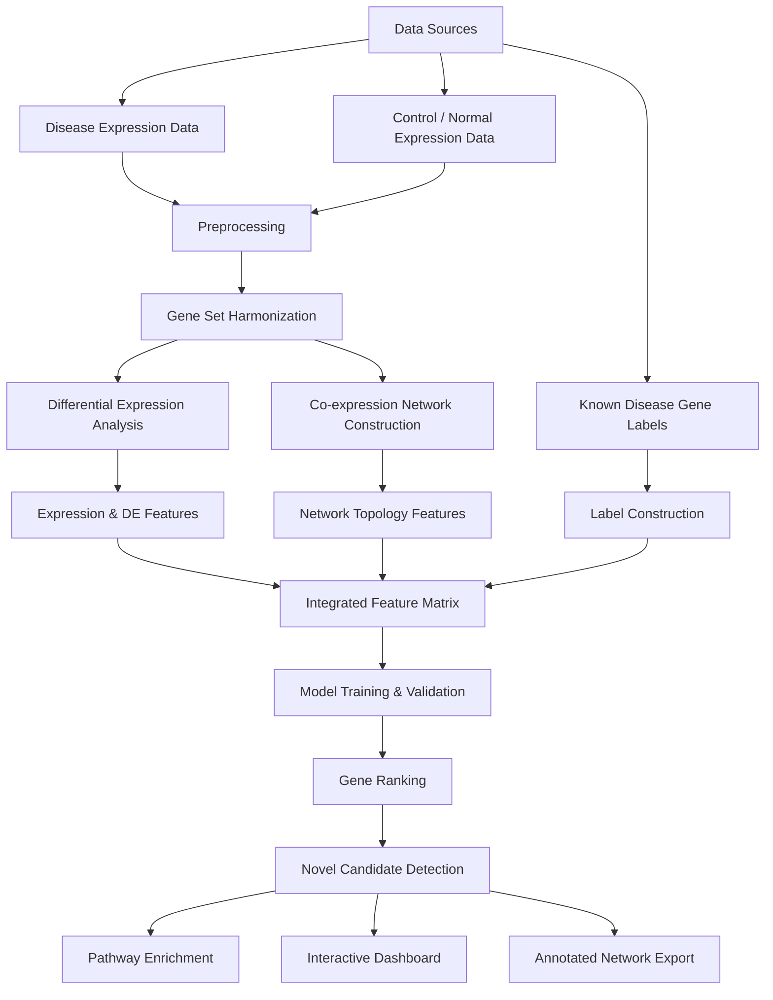

# 🌌 GLOOM

> **Gene network Learning and Organization through Optimized Machine intelligence**
> A general-purpose, reproducible package for **gene prioritization, co-expression network construction, and machine-learning-based candidate gene discovery**.

<p align="center">
  

</p>


> 🧪 **Starting workflow:** LUAD
> 🕸️ **Core idea:** combine expression + network topology + machine learning
> 📈 **Main output:** ranked known and novel candidate genes
> 🔬 **Goal:** support biological discovery and downstream validation across disease contexts

---

## 🧭 Table of Contents

- 🌌 [Overview](#-overview)
- 💡 [Why GLOOM?](#-why-gloom)
- ⚙️ [What GLOOM Does](#️-what-gloom-does)
- 📊 [Key Results from the LUAD Case Study](#-key-results-from-the-luad-case-study)
- 🔄 [Workflow](#-workflow)
- 🧬 [Data Sources](#-data-sources)
- 🛠️ [Pipeline Stages](#️-pipeline-stages)
- 📦 [Installation](#-installation)
- 🚀 [Quick Start](#-quick-start)
- 📁 [Bring Your Own Data](#-bring-your-own-data)
- 📝 [Input File Format](#-input-file-format)
- 📂 [Output Files](#-output-files)
- 🤖 [Model Performance in the LUAD Case Study](#-model-performance-in-the-luad-case-study)
- 🔬 [Biological Validation](#-biological-validation)
- ⭐ [Feature Importance](#-feature-importance)
- ⚠️ [Limitations](#️-limitations)
- 🔮 [Future Work](#-future-work)
- 🗂️ [Repository Structure](#️-repository-structure)
- 🎯 [Example Use Case](#-example-use-case)
- 👥 [Contributors](#-contributors)
- 📚 [Citation](#-citation)
- ✅ [Summary](#-summary)

---

## 🌌 Overview

**GLOOM** is a reproducible Python package for prioritizing disease-associated genes using integrated expression analysis, co-expression network construction, network topology, and machine learning.

The package is designed as a **general framework** that can be adapted when suitable disease/control expression matrices and reference gene labels are provided. The current workflow starts with **lung adenocarcinoma (LUAD)** as the first demonstrated disease case study.

Traditional differential expression analysis identifies genes whose average expression differs between disease and control samples. However, some biologically important genes may not show the strongest fold-change but may occupy important positions in molecular interaction or co-expression networks. GLOOM addresses this limitation by combining:

- 🧪 Disease and control expression statistics
- 📈 Differential expression metrics
- 🕸️ Co-expression network topology
- 🤖 Supervised machine-learning classification
- 🧬 Gene-level ranking and biological validation

The final output is a ranked list of known and novel candidate genes supported by model scores, feature importance, pathway enrichment, and annotated network exports.

---

## 💡 Why GLOOM?

Complex diseases are often driven by many interacting genes rather than a single dominant alteration. This makes candidate gene discovery difficult when using only single-gene statistical methods.

GLOOM was designed to provide a unified and reusable solution for **gene prioritization and biological network analysis**.

| Challenge                                         | Traditional Workflow                                           | GLOOM Solution                                              |
| ------------------------------------------------- | -------------------------------------------------------------- | ----------------------------------------------------------- |
| Many separate tools are required                  | Manual preprocessing, DEA, network analysis, ML, visualization | One scriptable end-to-end package                           |
| Expression-only methods miss network-driven genes | Genes are analyzed independently                               | Co-expression topology is integrated                        |
| Candidate lists are difficult to prioritize       | Long DEG lists without ranking context                         | ML-based probability ranking                                |
| Reproducibility is hard                           | Many manual intermediate steps                                 | Modular pipeline with saved outputs                         |
| Biological interpretation is fragmented           | Tables, plots, and networks generated separately               | Reports, enrichment, and network exports generated together |

---

## ⚙️ What GLOOM Does

GLOOM converts gene expression inputs into biologically interpretable candidate-gene rankings and network outputs.

```mermaid
flowchart LR
    A[Raw Expression Data] --> B[Preprocessing & QC]
    B --> C[Gene Harmonization]
    C --> D[Differential Expression]
    D --> E[Co-expression Network]
    E --> F[Network Features]
    F --> G[Feature Integration]
    G --> H[Machine Learning]
    H --> I[Gene Ranking]
    I --> J[Novel Candidate Genes]
    J --> K[Pathway Enrichment & Reports]
```



### Main capabilities

- 📥 Load disease and control expression matrices
- 🧹 Clean and harmonize gene identifiers
- 📊 Perform differential expression analysis
- 🕸️ Construct a co-expression network
- 🔗 Extract graph-theoretic features
- 🧩 Integrate expression and network evidence
- 🤖 Train and compare machine-learning models
- 🏆 Rank genes by predicted disease relevance
- ✨ Identify high-confidence novel candidates
- 🛤️ Run pathway enrichment analysis
- 📤 Export interactive dashboards and network files

---

## 📊 Key Results from the LUAD Case Study

The current workflow starts with lung adenocarcinoma as the first disease setting. The LUAD analysis produced the following headline results:

| Result                                |            Value |
| ------------------------------------- | ---------------: |
| Shared genes analyzed                 | **10,986** |
| LUAD tumor samples                    |    **510** |
| Normal lung samples                   |    **604** |
| Significant genes by FDR              | **10,472** |
| Best validation AUROC                 | **0.9192** |
| Best validation AUPRC                 | **0.4023** |
| Known LUAD genes recovered in top 100 |     **59** |
| Precision@100                         |   **0.59** |
| Novel high-confidence candidates      |  **1,854** |

These results demonstrate the package's ability to combine expression-derived signals, network information, and supervised learning to recover known biology and nominate new candidate genes.

---

## 🔄 Workflow

The GLOOM workflow follows a complete analysis path from raw data to biological interpretation.



---

<p align="center">

  

</p>


## 🧬 Data Sources

GLOOM can be adapted to any disease context where the user provides compatible disease/control expression matrices and a disease-related reference gene list.

In the starting LUAD workflow, the package used:

| Data Type           | Source                            | Purpose                                 |
| ------------------- | --------------------------------- | --------------------------------------- |
| Disease expression  | TCGA / cBioPortal LUAD tumor data | Disease RNA-seq profiles                |
| Control expression  | GTEx lung tissue                  | Normal control reference                |
| Known disease genes | LCGene                            | Positive labels for supervised learning |

After harmonization, the starting LUAD workflow included:

- **10,986 shared genes**
- **510 LUAD tumor samples**
- **604 normal lung samples**

---

## 🛠️ Pipeline Stages

| Stage | Name                      | Description                                                                  |
| ----: | ------------------------- | ---------------------------------------------------------------------------- |
|     1 | Data loading              | Load disease, control, metadata, and label files                             |
|     2 | Preprocessing             | Clean values, transform expression, remove low-information genes             |
|     3 | Gene harmonization        | Standardize symbols and keep shared genes                                    |
|     4 | Differential expression   | Compute disease-vs-control expression differences                            |
|     5 | Expression features       | Generate per-gene expression statistics                                      |
|     6 | Co-expression network     | Build a Pearson-correlation-based disease network                            |
|     7 | Network features          | Extract degree, centrality, clustering, and component metrics                |
|     8 | Feature integration       | Merge expression, differential, and topology features                        |
|     9 | Label construction        | Assign known disease positives using a reference gene list                   |
|    10 | Train/validation split    | Create stratified training and validation sets                               |
|    11 | Model training            | Train Logistic Regression, Gradient Boosting, Random Forest, and Extra Trees |
|    12 | Model evaluation          | Compute AUROC, AUPRC, F1, precision, recall, MCC, and Brier score            |
|    13 | Feature importance        | Estimate important predictors using model-based and permutation methods      |
|    14 | Gene ranking              | Score and rank all genes by predicted probability                            |
|    15 | Novel candidate detection | Identify high-probability genes not already in the label database            |
|    16 | Pathway enrichment        | Perform pathway enrichment for candidate gene sets                           |
|    17 | Network annotation        | Add ranking and biological metadata to graph nodes                           |
|    18 | Visualization             | Generate volcano plots, ROC/PR curves, ranking plots, and dashboards         |
|    19 | Reporting                 | Export final reports, tables, model files, and network files                 |

---

## 📦 Installation

### Prerequisites

| Software | Recommended Version          |
| -------- | ---------------------------- |
| Python   | 3.12+                        |
| Conda    | Latest Anaconda or Miniconda |
| pip      | Latest stable version        |

### Clone the repository

```bash
git clone https://github.com/omicscodeathon/gloom.git
cd gloom
```

### Create an environment

```bash
conda create -n gloom python=3.12
conda activate gloom
```

### Install dependencies

```bash
pip install -r requirements.txt
```

### Install GLOOM locally

```bash
pip install -e .
```

### Check installation

```bash
gloom --version
gloom info
```

---

## 🚀 Quick Start

Run GLOOM using the built-in LUAD demonstration workflow and a candidate gene list.

```bash
gloom prioritize --genes genes.txt \
  --disease luad \
  --output results/
```

### Resume from a specific step

```bash
gloom prioritize --genes genes.txt \
  --output results/ \
  --from-step 11
```

### Change statistical thresholds

```bash
gloom prioritize --genes genes.txt \
  --fdr 0.05 \
  --log2fc 1.0 \
  --prob-threshold 0.5 \
  --output results/
```

### Export top genes as Excel

```bash
gloom prioritize --genes genes.txt \
  --top-k 100 \
  --format excel \
  --output results/
```

---

## 📁 Bring Your Own Data

GLOOM can run on user-provided disease and control expression matrices.

```bash
gloom run \
  --tumor-expr disease_expr.csv \
  --normal-expr control_expr.csv \
  --output results/
```

The command names currently use `--tumor-expr` and `--normal-expr` because the first implementation was developed for cancer analysis. Conceptually, these correspond to disease and control expression matrices.

### With metadata files

```bash
gloom run \
  --tumor-expr disease_expr.csv \
  --normal-expr control_expr.csv \
  --tumor-meta disease_meta.csv \
  --normal-meta control_meta.csv \
  --output results/
```

### With custom labels and candidate genes

```bash
gloom run \
  --tumor-expr disease_expr.csv \
  --normal-expr control_expr.csv \
  --genes my_candidates.txt \
  --labels known_genes.tsv \
  --output results/
```

---

## 📝 Input File Format

### Candidate gene file

The candidate gene file should contain one gene symbol per line.

```text
EGFR
KRAS
TP53
MET
ALK
MMP11
COL1A1
CXCL9
```

### Expression matrix format

Expression matrices should contain genes as rows and samples as columns.

| Gene | Sample_1 | Sample_2 | Sample_3 |
| ---- | -------: | -------: | -------: |
| EGFR |     5.21 |     6.14 |     5.98 |
| KRAS |     3.11 |     3.54 |     3.40 |
| TP53 |     7.80 |     7.12 |     8.05 |

Supported formats may include:

- `.csv`
- `.tsv`
- `.txt`
- compressed text files depending on the loader implementation

---

## 📂 Output Files

A single GLOOM run generates a structured output directory.

```text
results/
├── report.html
├── candidates/
│   ├── ranked_candidates.csv
│   └── novel_candidates.csv
├── tables/
│   ├── differential_expression.csv
│   ├── expression_features.csv
│   ├── network_features.csv
│   ├── integrated_feature_matrix.csv
│   └── feature_importance.csv
├── models/
│   ├── best_model.joblib
│   └── model_card.json
├── plots/
│   ├── volcano_plot.html
│   ├── roc_curve.html
│   ├── pr_curve.html
│   └── top_ranked_genes.html
└── network/
    ├── coexpression.graphml
    ├── coexpression.gml
    ├── edges.tsv
    └── cytoscape.json
```

### Main outputs

| Output                            | Description                                                       |
| --------------------------------- | ----------------------------------------------------------------- |
| `report.html`                   | Interactive summary dashboard                                     |
| `ranked_candidates.csv`         | All genes ranked by predicted probability                         |
| `novel_candidates.csv`          | High-probability genes not found in the known-gene reference list |
| `differential_expression.csv`   | Gene-level differential expression results                        |
| `integrated_feature_matrix.csv` | Final ML-ready feature matrix                                     |
| `feature_importance.csv`        | Ranked feature contributions                                      |
| `best_model.joblib`             | Serialized best-performing model                                  |
| `coexpression.graphml`          | Annotated graph for Cytoscape or Gephi                            |

---

## 🤖 Model Performance in the LUAD Case Study

Four machine-learning models were compared in the starting LUAD workflow.

| Model                         |        Val AUROC |        Val AUPRC |         Accuracy |               F1 |        Precision |           Recall |
| ----------------------------- | ---------------: | ---------------: | ---------------: | ---------------: | ---------------: | ---------------: |
| **Logistic Regression** | **0.9192** | **0.4023** | **0.9495** | **0.4064** | **0.3838** |           0.4318 |
| Gradient Boosting             |           0.9130 |           0.3579 |           0.9063 |           0.3795 |           0.2582 | **0.7159** |
| Extra Trees                   |           0.9077 |           0.3513 |           0.9327 |           0.3984 |           0.3101 |           0.5568 |
| Random Forest                 |           0.9091 |           0.3301 |           0.9249 |           0.3956 |           0.2919 |           0.6136 |

### Interpretation

- **Logistic Regression** achieved the best overall validation performance.
- **Gradient Boosting** recovered more positives but produced more false positives.
- **Tree-based models** showed stronger sensitivity but lower precision.
- The task remains difficult because the labels follow a positive-unlabeled structure.

---

## 🔬 Biological Validation

In the starting LUAD workflow, GLOOM recovered known disease biology and identified novel candidates supported by pathway-level signals.

### Top novel candidates from the starting LUAD workflow

| Gene   | Predicted Probability | Rank | log2FC |
| ------ | --------------------: | ---: | -----: |
| H19    |                0.9994 |    2 |   6.20 |
| SFTPB  |                0.9993 |    3 |   4.44 |
| EIF1AY |                0.9992 |    5 |   4.04 |
| PGC    |                0.9990 |    6 |   2.65 |
| ITLN1  |                0.9989 |    8 |   0.40 |
| SFTPA2 |                0.9986 |   11 |   3.91 |
| MMP11  |                0.9971 |   20 |   8.93 |

### Enriched KEGG pathways

The LUAD novel candidate set was enriched for biologically relevant processes, including:

- 🧱 ECM-receptor interaction
- 📌 Focal adhesion
- 🩸 Complement and coagulation cascades
- 🛡️ Cytokine-cytokine receptor interaction
- ⚡ PI3K-Akt signaling

These pathways suggest that GLOOM can capture extracellular matrix remodeling, immune signaling, and tumor microenvironment activity in the LUAD setting.

---

## ⭐ Feature Importance

Grouped feature importance in the starting LUAD workflow showed that expression-derived signals were the strongest contributors, while network features provided complementary biological refinement.

| Feature Group                          | Mean Normalized Importance |
| -------------------------------------- | -------------------------: |
| Tumor / disease expression statistics  |                     0.3088 |
| Rank features                          |                     0.2210 |
| Normal / control expression statistics |                     0.1558 |
| Differential expression                |                     0.1558 |
| Network edge weights                   |    Smaller but informative |
| Network topology                       |    Smaller but informative |
| Network component features             |    Smaller but informative |

### Interpretation

The starting LUAD workflow is mainly expression-driven, but network features help refine interpretation and support biologically coherent ranking.

---

## ⚠️ Limitations

GLOOM provides a prioritized candidate list, not a final set of validated biomarkers.

| Limitation                 | Explanation                                                                                      |
| -------------------------- | ------------------------------------------------------------------------------------------------ |
| Label incompleteness       | The known-gene reference list may not contain all true disease-associated genes                  |
| Positive-unlabeled setting | Some genes treated as negative may actually be hidden positives                                  |
| Class imbalance            | AUROC and accuracy can be high while positive-class recall remains challenging                   |
| Batch effects              | Disease and control datasets from different resources may contain residual technical differences |
| Network contribution       | Network features currently act more as refinement signals than dominant predictors               |
| Experimental validation    | Novel candidates require laboratory and clinical validation                                      |

---

## 🔮 Future Work

Planned and recommended extensions include:

- 🌍 Apply GLOOM to additional cancer types and non-cancer disease contexts
- 🧬 Integrate methylation, mutation, copy-number, and proteomics data
- 🧠 Add graph neural network embeddings
- 🔄 Test random-walk and network-diffusion features
- 📏 Benchmark against other gene prioritization tools
- 🎯 Improve positive-unlabeled learning strategies
- 🧫 Experimentally validate selected novel candidates
- 🎨 Expand visualization and reporting options

---

## 🗂️ Repository Structure

```text
gloom/
├── data/
│   ├── raw/
│   ├── interim/
│   └── processed/
├── gloom/
│   ├── cli.py
│   ├── config.py
│   ├── preprocessing.py
│   ├── differential_expression.py
│   ├── network.py
│   ├── features.py
│   ├── modeling.py
│   ├── ranking.py
│   ├── enrichment.py
│   └── reporting.py
├── outputs/
│   ├── tables/
│   ├── plots/
│   ├── models/
│   ├── network/
│   └── reports/
├── tests/
├── requirements.txt
├── pyproject.toml
├── README.md
└── LICENSE
```

---

## 🎯 Example Use Case

A researcher has disease and control expression matrices and wants to discover biologically relevant candidate genes.

With GLOOM, they can run:

```bash
gloom run \
  --tumor-expr disease_expression.csv \
  --normal-expr control_expression.csv \
  --labels known_disease_genes.csv \
  --output disease_results/
```

The tool then produces:

1. Differential expression results
2. Co-expression network
3. Integrated feature matrix
4. Trained ML models
5. Ranked gene list
6. Novel candidate list
7. Enriched pathways
8. Interactive report
9. Annotated network files

---

## 👥 Contributors

- Rahma Y. Abdelsalam
- Rana H. Abu-Zeid
- Malick Traore
- Khadija Adam Rogo
- Olaitan I. Awe

---

## 📚 Citation

If you use GLOOM in your work, please cite the project as:

```text
Abdelsalam RY, Abu-Zeid RH, Traore M, Rogo KA, Awe OI.
GLOOM: Gene network Learning and Organization through Optimized Machine intelligence.
A reproducible machine-learning package for gene prioritization and co-expression network construction.
2026.
```

---

## ✅ Summary

GLOOM provides a transparent and reusable package for moving from gene expression data to biologically meaningful candidate-gene rankings. By combining expression statistics, differential expression, co-expression network topology, machine learning, enrichment analysis, and interactive reporting, GLOOM supports reproducible gene prioritization and downstream experimental hypothesis generation.
