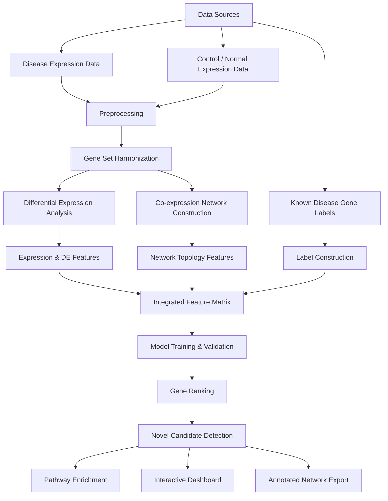

# 🌌 GLOOM

> **Gene network Learning and Organization through Optimized Machine intelligence**  
> A reproducible package for **gene prioritization, co-expression network construction, and machine-learning-based candidate gene discovery**.

<p align="center">
  
</p>


> 🧪 **Starting workflow:** LUAD  
> 🕸️ **Core idea:** combine expression + network topology + machine learning  
> 📈 **Main output:** ranked known and novel candidate genes  
> 🔬 **Goal:** support biological discovery and downstream validation across disease contexts

## 🌐 Project Landing Page

Explore the interactive GLOOM landing page here:

👉 **[Open GLOOM Landing Page](https://beta.sma-it.com/UI/gloom/)**

👉 **Cheat Sheet -> [preview.html](https://github.com/user-attachments/files/27089352/preview.html)**

---

## 🧭 Table of Contents

- 🌌 [Overview](#-overview)
- 💡 [Why GLOOM?](#-why-gloom)
- ⚙️ [What GLOOM Does](#️-what-gloom-does)
- 📊 [Key Results from the LUAD Case Study](#-key-results-from-the-luad-case-study)
- 🔄 [Workflow](#-workflow)
- 🧬 [Data Sources](#-data-sources)
- 🛠️ [Pipeline Stages](#️-pipeline-stages)
- 📦 [Installation](#-installation)
- 💻 [CLI Commands Reference](#-cli-commands-reference)
- 🚀 [Quick Start: gloom prioritize](#-quick-start-gloom-prioritize)
- 📁 [Bring Your Own Data: gloom run](#-bring-your-own-data-gloom-run)
- 🔀 [Understanding the Two Commands](#-understanding-the-two-commands)
- 📝 [Input File Formats](#-input-file-formats)
- 📂 [Output Files](#-output-files)
- 🤖 [Model Performance in the LUAD Case Study](#-model-performance-in-the-luad-case-study)
- 🔬 [Biological Validation](#-biological-validation)
- ⭐ [Feature Importance](#-feature-importance)
- ⚠️ [Limitations](#️-limitations)
- 🔮 [Future Work](#-future-work)
- 🗂️ [Repository Structure](#️-repository-structure)
- 🎯 [Example Use Case](#-example-use-case)
- 👥 [Contributors](#-contributors)
- 📚 [Acknowledgments](#-acknowledgments)
- ✅ [Summary](#-summary)

---

## 🌌 Overview

**GLOOM** is a reproducible Python package for prioritizing disease-associated genes using integrated expression analysis, co-expression network construction, network topology, and machine learning.

The package is designed as a **general framework** that can be adapted when suitable disease/control expression matrices and reference gene labels are provided. The current workflow starts with **lung adenocarcinoma (LUAD)** as the first demonstrated disease case study.

Traditional differential expression analysis identifies genes whose average expression differs between disease and control samples. However, some biologically important genes may not show the strongest fold-change but may occupy important positions in molecular interaction or co-expression networks. GLOOM addresses this limitation by combining:

- 🧪 Disease and control expression statistics
- 📈 Differential expression metrics
- 🕸️ Co-expression network topology
- 🤖 Supervised machine-learning classification (PU learning framework)
- 🧬 Gene-level ranking and biological validation

The final output is a ranked list of known and novel candidate genes supported by model scores, feature importance, pathway enrichment, and annotated network exports.

---

## 💡 Why GLOOM?

Complex diseases are often driven by many interacting genes rather than a single dominant alteration. This makes candidate gene discovery difficult when using only single-gene statistical methods.

GLOOM was designed to provide a unified and reusable solution for **gene prioritization and biological network analysis**.

| Challenge | Traditional Workflow | GLOOM Solution |
|---|---|---|
| Many separate tools are required | Manual preprocessing, DEA, network analysis, ML, visualization | One scriptable end-to-end package |
| Expression-only methods miss network-driven genes | Genes are analyzed independently | Co-expression topology is integrated |
| Candidate lists are difficult to prioritize | Long DEG lists without ranking context | ML-based probability ranking |
| Reproducibility is hard | Many manual intermediate steps | Modular pipeline with cached outputs |
| Biological interpretation is fragmented | Tables, plots, and networks generated separately | Reports, enrichment, and network exports generated together |

---

## ⚙️ What GLOOM Does

GLOOM converts gene expression inputs into biologically interpretable candidate-gene rankings and network outputs.

```mermaid
flowchart LR
    A[Raw Expression Data] --> B[Preprocessing & QC]
    B --> C[Gene Harmonization]
    C --> D[Differential Expression]
    D --> E[Co-expression Network]
    E --> F[Network Features]
    F --> G[Feature Integration]
    G --> H[Machine Learning]
    H --> I[Gene Ranking]
    I --> J[Novel Candidate Genes]
    J --> K[Pathway Enrichment & Reports]
```



### Main capabilities

- 📥 Load disease and control expression matrices
- 🧹 Clean and harmonize gene identifiers
- 📊 Perform differential expression analysis (Welch t-test with BH correction)
- 🕸️ Construct a Pearson-correlation co-expression network
- 🔗 Extract graph-theoretic features (degree, centrality, clustering, components)
- 🧩 Integrate expression and network evidence into a unified feature matrix
- 🤖 Train and compare machine-learning models (Random Forest, Gradient Boosting, Extra Trees, XGBoost, Logistic Regression)
- 🏆 Build a calibrated soft-voting ensemble
- 📈 Rank genes by predicted disease relevance
- ✨ Identify high-confidence novel candidates
- 🛤️ Run KEGG pathway enrichment analysis
- 📤 Export interactive dashboards and network files (GraphML, Cytoscape)

---

## 📊 Key Results from the LUAD Case Study

The current workflow starts with lung adenocarcinoma as the first disease setting. The LUAD analysis produced the following results:

| Result | Value |
|---|--:|
| Shared genes analyzed | **10,986** |
| LUAD tumor samples (TCGA/cBioPortal) | **510** |
| Normal lung samples (GTEx v11) | **604** |
| Known LUAD genes retained (LCGene) | **438 / 517** |
| Significant DE genes (FDR <= 0.001) | **10,882** |
| Upregulated genes | **9,700** |
| Co-expression network nodes | **4,977** |
| Co-expression network edges | **110,508** |
| Integrated features | **30** (21 after selection) |
| Best single model (Extra Trees) Val AUROC | **0.9269** |
| Best single model (Extra Trees) Val AUPRC | **0.5361** |
| Ensemble Val AUROC | **0.9293** |
| Ensemble Val AUPRC | **0.5264** |
| Precision@100 (Extra Trees) | **0.4900** |
| Recall@100 (Extra Trees) | **0.5568** |
| Total pipeline runtime | **~5.7 min** |

---

## 🔄 Workflow

The GLOOM workflow follows a complete analysis path from raw data to biological interpretation.



---

<p align="center">
  
</p>

---

## 🧬 Data Sources

GLOOM can be adapted to any disease context where the user provides compatible disease/control expression matrices and a disease-related reference gene list.

In the starting LUAD workflow, the package used:

| Data Type | Source | Details |
|---|---|---|
| Disease expression | TCGA / cBioPortal LUAD | 20,531 genes, 512 samples (510 after QC) |
| Control expression | GTEx v11 lung tissue | 74,628 transcripts, 604 RNA-seq samples |
| Known disease genes | LCGene (LUAD-filtered) | 517 curated LUAD-associated genes |
| Disease metadata | cBioPortal clinical | 566 patients, 35 clinical variables |
| Normal metadata | GTEx sample attributes | 604 samples, 10 QC columns (RIN, autolysis, map rate) |

After harmonization:

- **10,986 shared genes** across tumor and normal datasets
- **510 LUAD tumor samples**
- **604 normal lung samples**
- **438 LCGene genes** retained in the shared gene universe (84.7%)

### ⚠️ Important note about LCGene

LCGene is a curated database of **expression-based LUAD biomarkers** (297 upregulated, 220 downregulated). It does **not** include many well-known mutation-driven oncogenes/tumor suppressors (e.g., EGFR, KRAS, TP53, BRAF, MET). The model therefore learns expression-signature patterns, not mutation-driven oncogenesis. Users studying mutation-driven genes should provide a custom `--labels` file that includes their genes of interest as known positives.

---

## 🛠️ Pipeline Stages

GLOOM runs 20 steps (0-19) in sequence. Each step caches its outputs so the pipeline can be resumed from any point.

| Stage | Name | Description |
|--:|---|---|
| 0 | Config | Create output directories and validate configuration |
| 1 | Data loading | Load disease, control, metadata, and label files |
| 2 | Preprocessing | Clean values, log2-transform, remove low-expression/low-variance genes |
| 3 | Gene harmonization | Standardize gene symbols and intersect to shared genes |
| 4 | Differential expression | Welch t-test with Benjamini-Hochberg FDR correction |
| 5 | Expression features | Generate 29 per-gene expression statistics (mean, std, CV, skewness, kurtosis, ranks) |
| 6 | Co-expression network | Build Pearson-correlation network (default cutoff \|r\| >= 0.6) |
| 7 | Network features | Extract 13 topology features (degree, centrality, clustering, components) |
| 8 | Feature integration | Merge expression + network features, remove collinear features (30 final) |
| 9 | Label construction | Assign PU labels using reference gene list, trim noisy unlabeled genes |
| 10 | Train/validation split | Stratified 80/20 split with feature selection (top 21 features) |
| 11 | Model training | Train 5 models with CV, hyperparameter tuning, and calibration |
| 12 | Model evaluation | Compute AUROC, AUPRC, F1, MCC, Brier score; build calibrated ensemble |
| 13 | Feature importance | Model-based and permutation importance analysis |
| 14 | Gene ranking | Score all genes, flag novel candidates based on probability thresholds |
| 15 | Network annotation | Add ranking and biological metadata to graph nodes |
| 16 | Network export | Export annotated network as GraphML, Cytoscape XML, edge/node tables |
| 17 | Interactive visualization | Generate volcano plots, ROC/PR curves, dashboards (Plotly HTML) |
| 18 | Final report | Export summary report (HTML) with all key results |
| 19 | KEGG enrichment | Pathway enrichment analysis for candidate gene sets |

---

## 📦 Installation

### Prerequisites

| Software | Recommended Version |
|---|---|
| Python | 3.12+ |
| Conda | Latest Anaconda or Miniconda |
| pip | Latest stable version |

### Option 1: Install from Conda (recommended)

Install GLOOM directly from the conda channel using the Anaconda Prompt:

```bash
conda install -c conda-forge gloom
```

This installs GLOOM and all core dependencies (click, pandas, numpy, scipy, statsmodels, scikit-learn, joblib, networkx, matplotlib).

After installation, install the optional features for the full pipeline experience:

```bash
conda install -c conda-forge plotly openpyxl imbalanced-learn
pip install gseapy>=0.10.8
```

### Option 2: Install from source (development)

Clone the repository and install locally:

```bash
git clone https://github.com/omicscodeathon/gloom.git
cd gloom
```

**Using conda environment file (installs all dependencies at once):**

```bash
conda env create -f environment.yml
conda activate gloom
pip install -e .
```

**Or manually:**

```bash
conda create -n gloom python=3.12
conda activate gloom
pip install -e .
```

To install with all optional features:

```bash
pip install -e ".[full]"
```

Available optional groups:

| Group | What it enables | Install command |
|---|---|---|
| `interactive` | Plotly HTML dashboards (Step 17) | `pip install -e ".[interactive]"` |
| `kegg` | KEGG pathway enrichment (Step 19) | `pip install -e ".[kegg]"` |
| `excel` | Excel output (`--format excel`) | `pip install -e ".[excel]"` |
| `resampling` | SMOTE / undersampling (Step 11) | `pip install -e ".[resampling]"` |
| `full` | All optional features | `pip install -e ".[full]"` |
| `dev` | Developer tools (pytest, black, ruff, mypy) | `pip install -e ".[dev]"` |
| `all` | Everything (full + dev) | `pip install -e ".[all]"` |

### Option 3: Build the conda package locally

```bash
conda build conda.recipe/
conda install --use-local gloom
```

### Verify installation

```bash
gloom --version
gloom info
gloom diseases
```

---

## 💻 CLI Commands Reference

GLOOM provides the following CLI commands:

| Command | Purpose |
|---|---|
| `gloom info` | Show version, bundled reference paths, default thresholds, and cached runs |
| `gloom diseases` | List supported `--disease` values and their data sources |
| `gloom validate --data-dir DIR` | Check that all required input files are present before running |
| `gloom cache clear [--output DIR]` | Delete cached intermediate files to force a full re-run |
| `gloom prioritize` | Run the full pipeline using bundled reference data (cBioPortal + GTEx) |
| `gloom run` | Run the full pipeline using your own expression matrices |

### Common options (shared by `prioritize` and `run`)

| Option | Description | Default |
|---|---|---|
| `--output DIR` | Output directory (created if needed) | *required* |
| `--genes FILE` | Query gene list (.txt, one symbol per line) | all genes ranked |
| `--labels FILE` | Custom positive gene list (CSV/TSV with GeneSymbol column) | bundled LCGene |
| `--fdr FLOAT` | FDR cutoff for differential expression | 0.05 |
| `--log2fc FLOAT` | Log2 fold-change threshold for DE | 1.0 |
| `--prob-threshold FLOAT` | Minimum probability to flag novel candidates | 0.50 |
| `--top-k N` | Keep only the top N candidates in output | all |
| `--format {csv,excel,json}` | Output file format for candidate tables | csv |
| `--from-step N` | Resume pipeline from this step | 0 (prioritize) / 2 (run) |
| `--to-step N` | Stop after this step | 19 |
| `--no-cache` | Force full re-run by clearing cached intermediates | off |
| `--verbose` | Enable DEBUG-level logging | off |
| `--dry-run` | Validate inputs and show execution plan without running | off |

---

## 🚀 Quick Start: gloom prioritize

`gloom prioritize` runs the **full pipeline** (Steps 0-19) using the **bundled LUAD reference data** (cBioPortal tumor + GTEx normal + LCGene labels). The `--genes` file is used to tag query genes of interest in the final ranking.

```bash
gloom prioritize --genes genes.txt \
  --disease luad \
  --output results/
```

### Resume from a specific step

```bash
gloom prioritize --genes genes.txt \
  --output results/ \
  --from-step 11
```

### Change statistical thresholds

```bash
gloom prioritize --genes genes.txt \
  --fdr 0.05 \
  --log2fc 1.0 \
  --prob-threshold 0.5 \
  --output results/
```

### Export top genes as Excel

```bash
gloom prioritize --genes genes.txt \
  --top-k 100 \
  --format excel \
  --output results/
```

### Use custom labels instead of LCGene

```bash
gloom prioritize --genes genes.txt \
  --labels my_known_genes.csv \
  --output results/
```

### Preview what would run (dry run)

```bash
gloom prioritize --genes genes.txt \
  --output results/ \
  --dry-run
```

---

## 📁 Bring Your Own Data: gloom run

`gloom run` trains a **new model from scratch** on **your own expression matrices**. Step 1 (data loading) is bypassed — your files are staged directly into the pipeline cache and preprocessing starts at Step 2.

```bash
gloom run \
  --tumor-expr tumor_expression.csv \
  --normal-expr normal_expression.csv \
  --output results/
```

The flag names `--tumor-expr` and `--normal-expr` reflect the cancer-first design. Conceptually, these correspond to **disease** and **control** expression matrices for any context.

### With metadata files

```bash
gloom run \
  --tumor-expr disease_expr.csv \
  --normal-expr control_expr.csv \
  --tumor-meta disease_meta.csv \
  --normal-meta control_meta.csv \
  --output results/
```

### With custom labels and candidate genes

```bash
gloom run \
  --tumor-expr disease_expr.csv \
  --normal-expr control_expr.csv \
  --genes my_candidates.txt \
  --labels known_genes.tsv \
  --output results/
```

### Full example with all options

```bash
gloom run \
  --tumor-expr tumor.csv \
  --normal-expr normal.csv \
  --genes candidates.txt \
  --labels known_positive_genes.tsv \
  --fdr 0.05 --log2fc 1.0 --prob-threshold 0.5 \
  --top-k 200 --format excel \
  --output my_results/
```

---

## 🔀 Understanding the Two Commands

| | `gloom prioritize` | `gloom run` |
|---|---|---|
| **Data source** | Bundled cBioPortal + GTEx (hardcoded) | Your own `--tumor-expr` / `--normal-expr` |
| **Step 1** | Loads from bundled raw files | Skipped (your files staged directly) |
| **Steps 2-19** | Runs fully | Runs fully |
| **Model training** | Yes, from scratch on bundled data | Yes, from scratch on your data |
| **`--genes` file** | Tags query genes in final ranking | Tags query genes in final ranking |
| **When to use** | Quick analysis using LUAD reference cohort | When you have your own expression data |

**Important:** Both commands train the model from scratch every time. The `--genes` file does **not** influence model training in either command — it only marks which genes are flagged as "query genes" for the novel candidate check at Step 14.

To train on your own data, use `gloom run`. To use the built-in LUAD reference cohort, use `gloom prioritize`.

---

## 📝 Input File Formats

### Query gene file (`--genes`)

One gene symbol per line. Used to tag genes of interest in the ranking output.

```text
EGFR
KRAS
TP53
MET
ALK
MMP11
COL1A1
CXCL9
```

### Expression matrix format (`--tumor-expr` / `--normal-expr`)

CSV with gene symbols as the row index and sample IDs as column headers. Values should be raw expression counts or TPM (the pipeline applies log2 transformation).

```
gene,Sample_1,Sample_2,Sample_3
EGFR,1234.5,2345.6,5678.9
KRAS,567.8,678.9,789.0
TP53,890.1,901.2,123.4
```

### Labels file (`--labels`)

CSV or TSV with a column containing known positive gene symbols. Recognized column names: `GeneSymbol`, `gene_symbol`, `gene`, `symbol`, `hgnc_symbol`.

```
GeneSymbol
EGFR
KRAS
TP53
BRCA1
```

### Metadata files (`--tumor-meta` / `--normal-meta`)

Optional. CSV with sample IDs as the row index. Any additional columns are preserved. If omitted, all samples in the expression matrix are used.

---

## 📂 Output Files

A single GLOOM run generates a structured output directory:

```text
results/
├── report.html                        # Interactive summary dashboard
├── candidates/
│   ├── ranked_candidates.csv          # All query genes ranked by predicted probability
│   └── novel_candidates.csv           # High-probability candidates not in reference label set
├── tables/
│   ├── de_results.csv                 # Differential expression results
│   └── network_features.csv           # Per-gene network topology features
├── models/
│   ├── best_model.joblib              # Serialized best-performing model
│   └── model_card.json                # Model metadata and hyperparameters
├── plots/
│   ├── volcano_plot.html              # Interactive volcano plot
│   ├── roc_pr_curves.html             # ROC and PR curves for all models
│   ├── feature_importance.html        # Feature importance visualization
│   └── kegg_pathways.html             # KEGG enrichment results
├── network/
│   ├── coexpression.graphml           # Annotated network for Gephi/Cytoscape
│   └── coexpression.cytoscape.xml     # Cytoscape-ready XML
└── .pipeline_cache/                   # Intermediate files (can be cleared with gloom cache clear)
    ├── processed/                     # Preprocessed expression matrices, features, labels
    ├── results/                       # Full gene rankings, DE results, enrichment
    ├── models/                        # All trained models and CV results
    ├── figures/                       # All generated plots (PNG + HTML)
    └── logs/                          # Pipeline log files
```

### Main output files

| Output | Description |
|---|---|
| `report.html` | Interactive HTML summary dashboard with all key results |
| `ranked_candidates.csv` | Query genes ranked by predicted probability with DE and network annotations |
| `novel_candidates.csv` | High-probability query genes not in the known-gene reference list |
| `de_results.csv` | Gene-level differential expression (log2FC, p-value, FDR, direction) |
| `network_features.csv` | Per-gene network topology metrics |
| `best_model.joblib` | Serialized best-performing calibrated model |
| `model_card.json` | Model metadata: type, hyperparameters, validation metrics |
| `coexpression.graphml` | Annotated co-expression network for Gephi or Cytoscape |

### Columns in ranked_candidates.csv

| Column | Description |
|---|---|
| `gene` | Gene symbol |
| `predicted_prob` | ML-predicted probability of disease association |
| `rank` | Rank by predicted probability (1 = highest) |
| `percentile` | Percentile rank across all scored genes |
| `predicted_label` | Binary prediction (1 = predicted positive) |
| `label` | Training label (1 = known positive from reference list, 0 = unlabeled) |
| `is_lcgene_gene` | Whether the gene is in the reference label set |
| `log2fc` | Log2 fold-change (disease vs. control) |
| `pvalue_adj` | FDR-adjusted p-value |
| `direction` | DE direction: `up`, `down`, or `ns` (not significant) |
| `is_query_gene` | Whether the gene was in the user's `--genes` file |
| `novel_candidate` | Flagged as novel (query + not in labels + high probability + DE significant) |

---

## 🤖 Model Performance in the LUAD Case Study

Five machine-learning models plus a calibrated ensemble were compared in the LUAD workflow.

### Cross-Validation Results (5-fold, training set)

| Model | CV AUROC | CV AUPRC | CV F1 | CV MCC |
|---|--:|--:|--:|--:|
| Gradient Boosting | 0.9400 +/- 0.0065 | 0.5002 +/- 0.0427 | 0.4056 +/- 0.0249 | 0.4367 +/- 0.0252 |
| XGBoost | 0.9390 +/- 0.0088 | 0.5000 +/- 0.0147 | 0.3511 +/- 0.0173 | 0.4002 +/- 0.0149 |
| Random Forest | 0.9379 +/- 0.0066 | 0.4843 +/- 0.0186 | 0.4384 +/- 0.0106 | 0.4442 +/- 0.0088 |
| Extra Trees | 0.9359 +/- 0.0081 | 0.4697 +/- 0.0181 | 0.4381 +/- 0.0230 | 0.4412 +/- 0.0287 |
| Logistic Regression | 0.7850 +/- 0.0256 | 0.1498 +/- 0.0310 | 0.1282 +/- 0.0047 | 0.1443 +/- 0.0100 |

### Validation Set Results

| Model | Val AUROC | Val AUPRC | F1 (oracle) | MCC | Precision@100 | Recall@100 |
|---|--:|--:|--:|--:|--:|--:|
| **Extra Trees** | **0.9269** | **0.5361** | **0.5455** | **0.5132** | **0.4900** | **0.5568** |
| **Ensemble (soft vote)** | **0.9293** | **0.5264** | **0.5287** | **0.4584** | **0.4800** | **0.5455** |
| Gradient Boosting | 0.9269 | 0.5066 | 0.4910 | 0.4189 | 0.4300 | 0.4886 |
| XGBoost | 0.9233 | 0.4970 | 0.4713 | 0.4136 | 0.4000 | 0.4545 |
| Random Forest | 0.9171 | 0.4916 | 0.5140 | 0.4653 | 0.4600 | 0.5227 |
| Logistic Regression | 0.8477 | 0.2706 | 0.3761 | 0.3317 | 0.3200 | 0.3636 |

### Interpretation

- **Extra Trees** achieved the best validation AUPRC (0.5361) and was selected as the best single model.
- The **calibrated ensemble** (AUPRC-weighted soft vote) provided the highest AUROC (0.9293).
- **Tree-based models** consistently outperformed Logistic Regression, which is expected given the non-linear feature interactions in co-expression and network topology data.
- The task is inherently difficult due to the **positive-unlabeled (PU) learning** framework: unlabeled genes include both true negatives and hidden positives.
- All models were calibrated using sigmoid calibration on a holdout set.

---

## 🔬 Biological Validation

### LCGene gene recovery

In the starting LUAD workflow, 438 out of 517 LCGene genes were retained after gene harmonization (84.7%). The top-ranked known genes include:

| Gene | Predicted Prob | Rank | Percentile | log2FC | Direction |
|---|--:|--:|--:|--:|---|
| IL6 | 0.8812 | 46 | 99.6 | 1.28 | ns |
| CD274 | 0.8707 | 57 | 99.5 | 1.18 | ns |
| ROS1 | 0.7718 | 206 | 98.1 | 5.76 | up |
| SOX2 | 0.6967 | 354 | 96.8 | 5.94 | up |
| RET | 0.6690 | 399 | 96.4 | 4.74 | up |
| FGFR2 | 0.6377 | 448 | 95.9 | 5.76 | up |
| MUC1 | 0.6086 | 501 | 95.5 | 5.68 | up |
| NKX2-1 | 0.5955 | 526 | 95.2 | 4.58 | up |

### Novel candidate detection

Novel candidates are defined as query genes that are:
1. **Not** in the reference label set (LCGene)
2. Predicted probability >= threshold (default 0.70; sensitivity threshold 0.50)
3. Differentially expressed (|log2FC| >= 1.0)

In the demonstration run with 100 well-known LUAD genes as query, **zero novel candidates** were detected. This is expected because:
- 14 of the 100 query genes are already in LCGene (cannot be "novel")
- The remaining 86 query genes are primarily **mutation-driven** oncogenes (EGFR, KRAS, TP53, etc.), not expression-pattern biomarkers
- LCGene trains the model to recognize **expression-signature** patterns, not mutation-driven cancer biology
- The highest-scoring non-LCGene query gene was MET (prob=0.49), below the 0.50 sensitivity threshold

**Recommendation:** When studying mutation-driven genes, provide a custom `--labels` file that includes your known driver genes as positives.

### 🛤️ Enriched KEGG pathways

KEGG pathway enrichment was performed on high-scoring candidate gene sets. Biologically relevant pathways enriched in the LUAD analysis include:

- 🧱 ECM-receptor interaction
- 📌 Focal adhesion
- 🩸 Complement and coagulation cascades
- 🛡️ Cytokine-cytokine receptor interaction
- ⚡ PI3K-Akt signaling

---

## ⭐ Feature Importance

The pipeline selects 21 features after collinearity removal. Grouped feature importance shows:

### Top 10 features (normalized importance)

| Rank | Feature | Category | Importance |
|--:|---|---|--:|
| 1 | tumor_std | Tumor expression stats | 0.8097 |
| 2 | tumor_iqr | Tumor expression stats | 0.4568 |
| 3 | normal_std | Normal expression stats | 0.4402 |
| 4 | neg_log10_padj | Differential expression | 0.3814 |
| 5 | tumor_cv | Tumor expression stats | 0.3116 |
| 6 | normal_iqr | Normal expression stats | 0.2341 |
| 7 | cohens_d | Differential expression | 0.2292 |
| 8 | abs_log2fc | Differential expression | 0.1589 |
| 9 | normal_cv | Normal expression stats | 0.1525 |
| 10 | normal_skewness | Normal expression stats | 0.1492 |

### Feature group contributions

| Feature Group | Role |
|---|---|
| Tumor / disease expression statistics | Primary signal (~50% of total importance) |
| Normal / control expression statistics | Strong complementary signal |
| Differential expression metrics | Core discriminative features |
| Network topology (degree, centrality) | Biological refinement signal |
| Network edge weight statistics | Supplementary co-expression context |
| Differential network features | Tumor-vs-normal network rewiring |

The LUAD workflow is mainly expression-driven, but network features help refine interpretation and support biologically coherent ranking.

---

## ⚠️ Limitations

GLOOM provides a prioritized candidate list, not a final set of validated biomarkers.

| Limitation | Explanation |
|---|---|
| Label scope | LCGene captures expression-based biomarkers, not mutation-driven oncogenes. Users should provide custom labels when studying driver genes. |
| Positive-unlabeled setting | Some genes treated as negative may actually be hidden positives |
| Class imbalance | Positive rate is ~4.5% — AUROC can appear high while positive-class recall remains challenging |
| Batch effects | Disease and control datasets from different sources may contain residual technical differences |
| Network contribution | Network features currently act more as refinement signals than dominant predictors |
| Gene coverage | Only genes present in both tumor and normal expression matrices are scored |
| Experimental validation | Novel candidates require laboratory and clinical validation |

---

## 🔮 Future Work

Planned and recommended extensions include:

- 🌍 Apply GLOOM to additional cancer types and non-cancer disease contexts
- 🧬 Integrate methylation, mutation, copy-number, and proteomics data
- 🧠 Add graph neural network embeddings
- 🔄 Test random-walk and network-diffusion features
- 📏 Benchmark against other gene prioritization tools
- 🎯 Improve positive-unlabeled learning strategies
- 🧫 Experimentally validate selected novel candidates
- 🎨 Expand visualization and reporting options

---

## 🗂️ Repository Structure

```text
gloom/
├── data/
│   └── raw/
│       ├── cBioPortal (RNA Seq Data)/       # TCGA LUAD expression + clinical metadata
│       ├── Gtex (normal samples)/           # GTEx lung expression + sample attributes
│       └── LCGene (Labeled LUAD Data)/      # LCGene curated LUAD gene list
├── src/
│   └── gloom/
│       ├── __init__.py
│       ├── cli.py                           # CLI entry point (prioritize, run, info, etc.)
│       ├── output.py                        # Output organization and formatting
│       └── pipeline/
│           ├── config.py                    # Configuration and path management
│           ├── step1_data_loading.py
│           ├── step2_preprocessing.py
│           ├── step3_harmonization.py
│           ├── step4_differential_expression.py
│           ├── step5_expression_features.py
│           ├── step6_coexpression_network.py
│           ├── step7_network_features.py
│           ├── step8_feature_integration.py
│           ├── step9_label_construction.py
│           ├── step10_train_val_split.py
│           ├── step11_model_training.py
│           ├── step12_model_evaluation.py
│           ├── step13_feature_importance.py
│           ├── step14_gene_ranking.py
│           ├── step15_network_annotation.py
│           ├── step16_network_export.py
│           ├── step17_interactive_visualization.py
│           ├── step18_final_report.py
│           └── step19_kegg_enrichment.py
├── tests/
│   └── genes.txt                            # Example query gene list (100 LUAD genes)
├── pyproject.toml
├── environment.yml
├── LICENSE
└── README.md
```

---

## 🎯 Example Use Case

### Scenario 1: Using bundled LUAD reference data

A researcher has a list of candidate genes and wants to see how they rank in the LUAD expression landscape:

```bash
gloom prioritize --genes my_candidates.txt \
  --disease luad \
  --output luad_results/
```

### Scenario 2: Using your own expression data

A researcher has disease and control expression matrices and wants to discover biologically relevant candidate genes:

```bash
gloom run \
  --tumor-expr disease_expression.csv \
  --normal-expr control_expression.csv \
  --labels known_disease_genes.csv \
  --output disease_results/
```

### What GLOOM produces

Both commands generate:

1. Differential expression results with fold-change and FDR
2. Co-expression network (GraphML + Cytoscape)
3. Integrated feature matrix (expression + network)
4. Trained and calibrated ML models (5 models + ensemble)
5. Ranked gene list with predicted probabilities
6. Novel candidate list (high-confidence genes not in reference set)
7. KEGG pathway enrichment
8. Interactive HTML report and dashboard
9. Annotated network files for visualization

---

## 👥 Contributors

| Names | Affiliation(s) | Role(s) |
|---|---|---|
| Rahma Yasser Mahmoud | Faculty of Computers and Information, Assiut University, Assiut, Egypt | Team Leader |
| Khadija Adam Rogo | Department of Bioinformatics, Kalinga University, Raipur, India | |
| Rana Hamed Abu-Zeid | Department of Artificial Intelligence, Badya University, Giza, Egypt | |
| Malick Traore | African Center of Excellence in Bioinformatics and Data Science, USTTB, Mali | |
| Olaitan I. Awe | Institute for Genomic Medicine Research (IGMR); African Society for Bioinformatics and Computational Biology (ASBCB) | Project Advisor |

<br>📧 **Rahma Yasser Mahmoud**: rahmayasserm@gmail.com
<br>📧 **Rana Hamed Abu-Zeid**: ranahamed2111@gmail.com
<br>📧 **Khadija Adam Rogo**: khadijarogo212@gmail.com
<br>📧 **Malick Traore**: malicktra100@gmail.com
<br>📧 **Olaitan I. Awe, Ph.D.**: laitanawe@gmail.com

---

## 📚 Acknowledgments

We thank the contributors to open biomedical datasets (TCGA, GTEx, LCGene) and acknowledge the Python and bioinformatics open-source communities. Special thanks to all collaborators and advisors in LUAD and genomics research.

---

## ✅ Summary

GLOOM provides a transparent and reusable package for moving from gene expression data to biologically meaningful candidate-gene rankings. It offers two modes of operation:

- **`gloom prioritize`** for quick analysis using the bundled LUAD reference cohort
- **`gloom run`** for training on user-provided expression data

By combining expression statistics, differential expression, co-expression network topology, machine learning (with PU learning), enrichment analysis, and interactive reporting, GLOOM supports reproducible gene prioritization and downstream experimental hypothesis generation.
