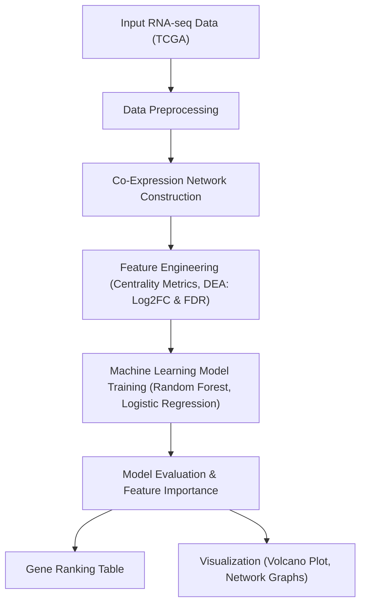

# gloom: Gene network Learning and Organization through Optimized Machine intelligence

In this study, we developed **_gloom_**, a framework for prioritizing disease-associated genes and reconstructing gene interaction networks. This is a visualization package based on machine learning for gene expression analysis starting with lung adenocarcinoma (TCGA-LUAD), designed to predict cancer-relevant genes and present  the results through interpretable network visualizations. Future releases will expand to other diseases. This project therefore proposes an interpretable machine learning package, starting with LUAD candidate gene prioritization and co-expression network visualization. State-of-the-art methods either implement only gene prioritization or gene network visualization. With gloom, we have implemented both of these features into a single tool.

# gloom: An Interpretable Machine Learning Package for LUAD Gene Prioritization and Co-Expression Network Visualization

[](https://opensource.org/licenses/MIT)

<p align="center">

  

</p>

## Table of Contents

1. [Background](#background)
2. [Overview](#overview)
3. [Features](#features)
4. [Installation](#installation)
5. [Usage Workflow](#usage-workflow)
6. [Machine Learning Pipeline](#machine-learning-pipeline)
7. [Outputs &amp; Visualization](#outputs--visualization)
8. [Reproducibility](#reproducibility)
9. [License](#license)
10. [Contributors](#contributors)
11. [Acknowledgments](#acknowledgments)

---

<br>

## Background

Lung adenocarcinoma (LUAD) is a leading cause of cancer-related mortality worldwide, characterized by high molecular heterogeneity. The prioritization of driver genes is essential for biomarker discovery and therapeutic interventions. Classical bioinformatics workflows often separate predictive modeling from network visualization, which can hinder reproducibility and biological interpretability. To address this gap, **_gloom_** provides a modular, interpretable machine learning platform for prioritizing LUAD candidate genes by seamlessly integrating TCGA tumor/normal RNA-seq data and co-expression network topologies.

Features used for training include graph-theoretic metrics (e.g., Degree, Betweenness, PageRank) and differential expression statistics (Log2FC, FDR). Models-Random Forest and Logistic Regression-are trained and validated on LUAD-associated gene sets, leveraging both transcriptome signals and network centrality. Feature importance analysis demonstrates that combining network and expression data enhances prediction performance over single-modality approaches.

**_gloom_** transitions users from raw data to actionable biological insights, generating gene ranking tables, volcano plots, and automated co-expression network visualizations in a single, reproducible Python-based workflow.

> **Keywords:** Reproducible bioinformatics, gene prioritization, machine learning, lung cancer, co-expression networks.

---

## Overview

Despite large-scale transcriptome sequencing efforts (e.g., TCGA), effective identification of LUAD driver genes remains a challenge. Conventional differential expression analysis (DEA) can miss genes with subtle expression shifts but important roles in regulatory networks. Network-based approaches help, but researchers face fragmented solutions-visualization tools like Cytoscape lack automation and integrated ML; web solutions like PINTA lack customizability.

**_gloom_** bridges this gap by providing a unified platform that combines:

-**Preprocessing**: Automated expression and network feature extraction.

-**Modular Machine Learning**: Flexible model selection, interpretability via feature importance.

-**Visualization**: Generation of publication-ready figures (gene ranks, volcano plots, interactive co-expression graphs).

Unlike generic tools, gloom is tailored for LUAD, emphasizing transparent workflows, script-based customization, and reproducibility. Feature importance scoring highlights the contributions of both biological and topological markers to LUAD gene prioritization.

---

## Features

-**Seamless Integration** of RNA-seq and network topology data.

-**End-to-End Workflow**: From raw TCGA data to prioritized gene lists.

-**Interpretable ML**: Random Forest & Logistic Regression with feature importance.

-**Publication-Ready Outputs**: Tables, volcano plots, network diagrams.

-**Reproducible & Modular**: Designed for customization and robust re-use.

-**Python-based**: Scriptable, extensible workflows for advanced users.

---

## Installation

**_gloom_** is implemented primarily in Python with a simple setup:

```bash

pip install gloom

```

or via cloning this repository (for the latest version):

```bash

git clone https://github.com/omicscodeathon/gloom.git

cd gloom

pip install -r requirements.txt

```

---

## Usage Workflow

1. **Data Input**

   Accepts raw or preprocessed TCGA RNA-seq data (tumor/normal samples).

2. **Preprocessing**

   Generation of normalized expression matrices.

   Filtering low-quality samples/genes.

3. **Co-Expression Network Construction**

   Build gene co-expression network (correlation/WGCNA).

4. **Feature Engineering**

- Network Measures: Degree, Betweenness, PageRank.
- DEA: Log2 Fold Change, FDR.

5. **Machine Learning**

   Trains Random Forest and Logistic Regression models with known LUAD labels.

6. **Interpretation & Visualization**

- Feature importance analysis.
- Generation of gene ranking tables, volcano plots, network graphs.

---

## Machine Learning Pipeline

Below is the main workflow used in gloom for LUAD gene prioritization:



#### **Pipeline Step Descriptions**

-**Input RNA-seq Data (TCGA):**

  Start with raw or preprocessed RNA-seq data from TCGA for LUAD.

-**Data Preprocessing:**

  Normalize expression values, filter low-quality samples/genes, and prepare a standardized expression matrix.

-**Co-Expression Network Construction:**

  Build a gene co-expression network (e.g., using correlation or WGCNA) to explore gene-gene interactions.

-**Feature Engineering:**

  -*Centrality Metrics*: Calculate network topological features (Degree, Betweenness, PageRank).

  -*DEA Metrics*: Compute differential expression (Log2 Fold Change, FDR) between tumor and normal samples.

-**Machine Learning Model Training:**

  Use extracted features to train Random Forest and Logistic Regression models, using known LUAD genes as labels.

-**Model Evaluation & Feature Importance:**

  Assess model accuracy and extract feature importance scores for interpretability.

-**Gene Ranking Table:**

  Output a ranked table of candidate genes most likely involved in LUAD.

-**Visualization:**

  Automatically generate volcano plots and interactive co-expression network graphs for publication or downstream analysis.

---

## Outputs & Visualization

-**Gene Ranking Tables**: Prioritized candidate list based on combined features.

-**Feature Importance Plot**: Highlights strongest biological and topological predictors.

-**Volcano Plot**: Visual summary of differential expression.

-**Co-Expression Networks**: Publication-ready network figures in HTML/PNG/SVG.

<p align="center">

  

</p>

---

## Reproducibility

-**Version control** for all scripts and dependencies.

-**Fixed random seeds** in model training for deterministic results.

-**Extensive documentation and example notebooks** provided.

- Results are fully reproducible from documented commands.

---

## License

This project is licensed under the [MIT License](https://opensource.org/licenses/MIT).

---

## Contributors

|   Name   | Affiliation | Role |

|----------|-------------|------|

| [Names]                       | [Affiliations] | [Roles here] |
| -------------------------------------- | ------------------ | ----------------- |
| 𝑅𝑎ℎ𝑚𝑎 𝑌𝑎𝑠𝑠𝑒𝑟 𝑀𝑎ℎ𝑚𝑜𝑢𝑑 |                    |                   |
| 𝐾ℎ𝑎𝑑𝑖𝑗𝑎 𝐴𝑑𝑎𝑚 𝑅𝑜𝑔𝑜       |                    |                   |
| Rana H.Abu −zeid                      |                    |                   |
| Malick Traore                          |                    |                   |
| Olaitan I. Awe                         | Institute for Genomic Medicine Research (IGMR); African Society for Bioinformatics and Computational Biology (ASBCB)                 | Project Advisor                  |

<br>📧 **Rahma Yasser Mahmoud**: rahmayasserm@gmail.com
<br>📧 **Rana Hamed Abu-Zeid**: ranahamed2111@gmail.com
<br>📧 **Khadija Adam Rogo**: khadijarogo212@gmail.com
<br>📧 **Malick Traore**: malicktra100@gmail.com
<br>📧 **Olaitan I. Awe, Ph.D.** : laitanawe@gmail.com

---

## Acknowledgments

We thank the contributors to open biomedical datasets (TCGA) and acknowledge the Python and bioinformatics open-source communities. Special thanks to all collaborators and advisors in LUAD and genomics research.

---

*Gloom aims to bridge statistical genomics and network science, empowering integrative, reproducible, and interpretable machine learning for cancer research.*
