## `figures/` Directory

Contains static plots and interactive HTML dashboards generated during analysis.

| File Name | Description |
|--------------|--------------|
| `annotated_degree_vs_rank.png` | Network node degree versus ranking plot. |
| `cv_auroc_comparison.png` | Cross-validation AUROC score comparison. |
| `de_log2fc_distribution.png` | Distribution of differential expression log2 fold-changes. |
| `de_volcano_plot.png` | Volcano plot of differential expression results. |
| `eval_pr_curves.png` | Precision-Recall curves for model evaluation. |
| `eval_roc_curves.png` | ROC curves for classifier performance. |
| `expr_feature_correlation_heatmap.png` | Correlation heatmap of expression features. |
| `feature_importance_grouped.png` | Grouped feature importance visualization. |
| `harmonization_venn.png` | Venn diagram of gene overlap pre- and post-harmonization. |
| `integrated_feature_pca.png` | PCA plot of integrated features. |
| `interactive_dashboard.html` | (Moved to `dashboard/`) Interactive dashboard for exploring results. |
| `interactive_feature_importance.html` | Interactive feature importance visualization. |
| `interactive_network.html` | Interactive gene network visualization. |
| `interactive_ranking.html` | Dynamic feature ranking view. |
| `interactive_volcano.html` | Interactive volcano plot for DE results. |
| `label_class_balance.png` | Class distribution bar plot. |
| `network_degree_distribution.png` | Distribution of gene network node degrees. |
| `network_feature_distributions.png` | Distributions of network features. |
| `qc_gene_filter_summary.png` | QC summary of gene filtering. |
| `qc_normal_sample_distributions.png` | QC plots for normal samples. |
| `qc_tumor_sample_distributions.png` | QC plots for tumor samples. |
| `ranking_score_distribution.png` | Distribution of feature importance scores. |
| `split_feature_pca.png` | PCA plot showing train/validation split separation. |

### Static Figures

| Name                                     | Preview                                                                         | Description                                                |
| ---------------------------------------- | ------------------------------------------------------------------------------- | ---------------------------------------------------------- |
| `annotated_degree_vs_rank.png`         | 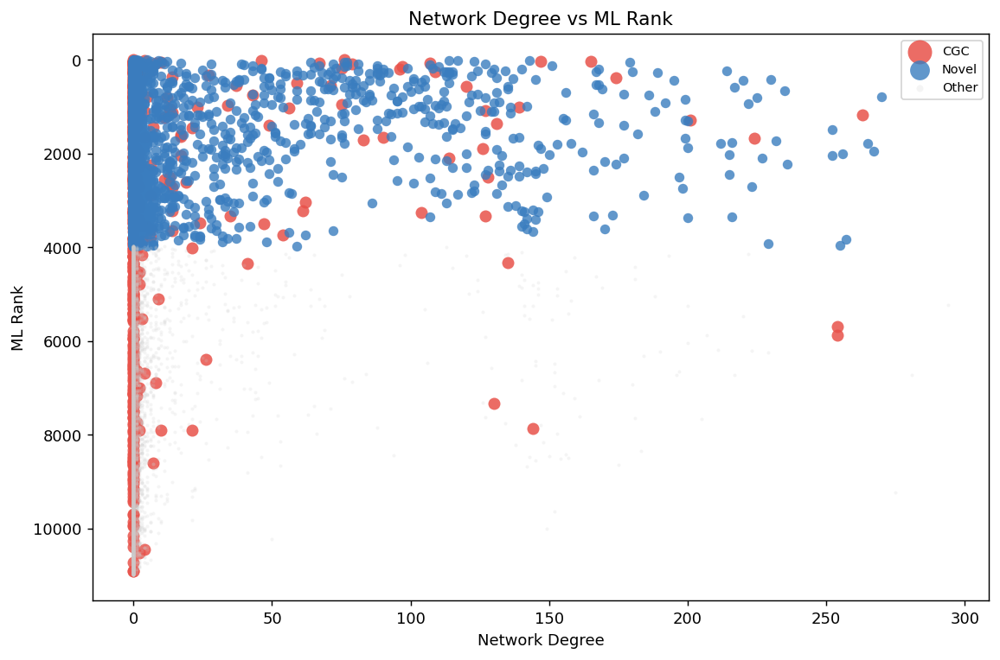                 | Network node degree versus ranking.                        |
| `cv_auroc_comparison.png`              | 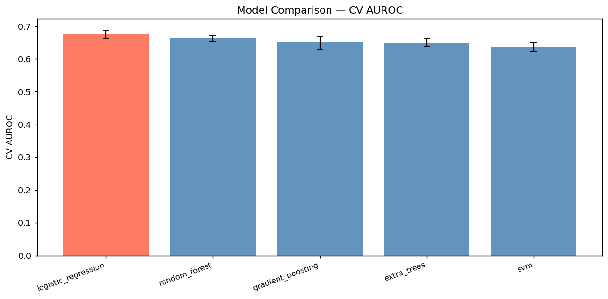                           | Cross-validation AUROC comparison.                         |
| `de_log2fc_distribution.png`           | 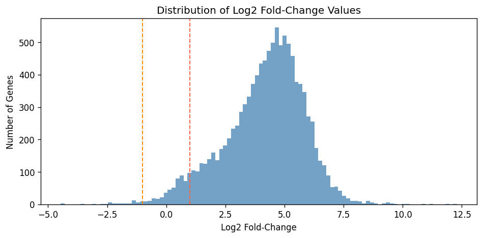                     | Distribution of differential expression log2 fold-changes. |
| `de_volcano_plot.png`                  | 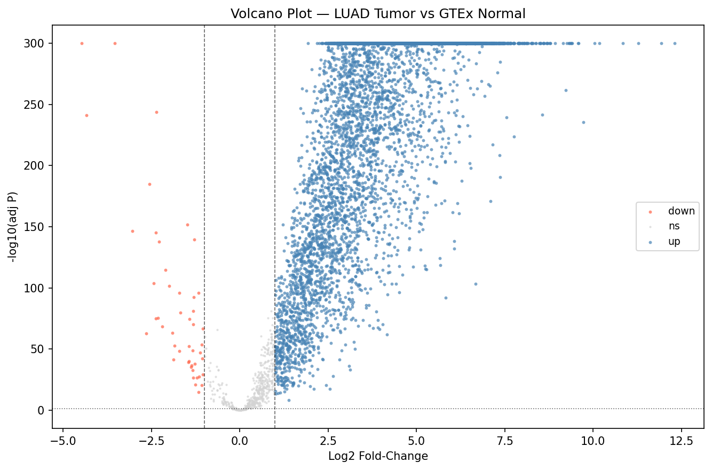                                   | Volcano plot of DE genes.                                  |
| `eval_pr_curves.png`                   | 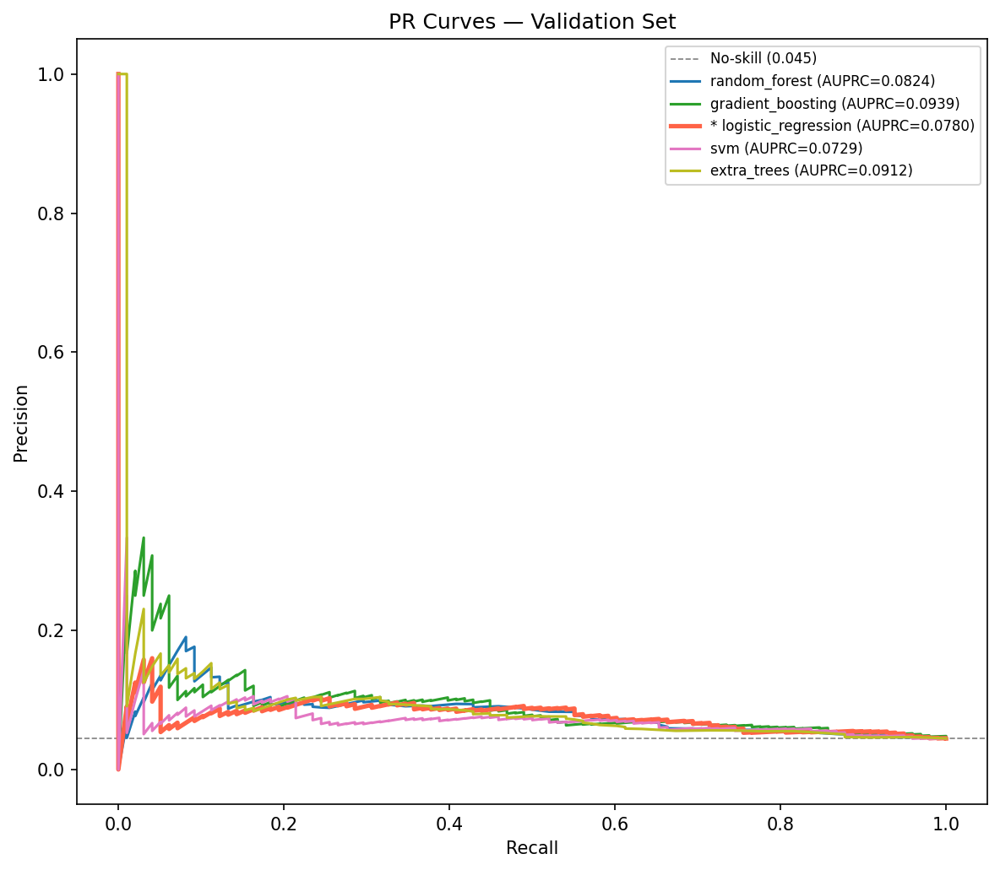                                     | Precision-Recall curves.                                   |
| `eval_roc_curves.png`                  | 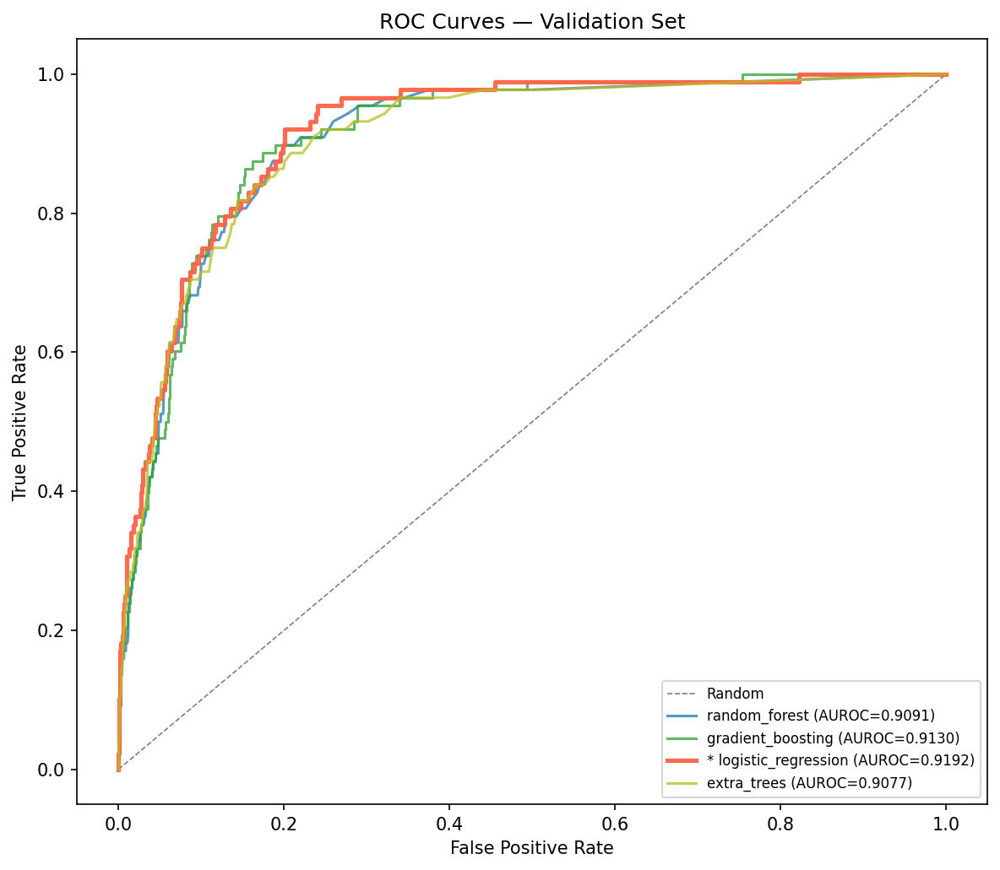                                   | ROC curves.                                                |
| `expr_feature_correlation_heatmap.png` | 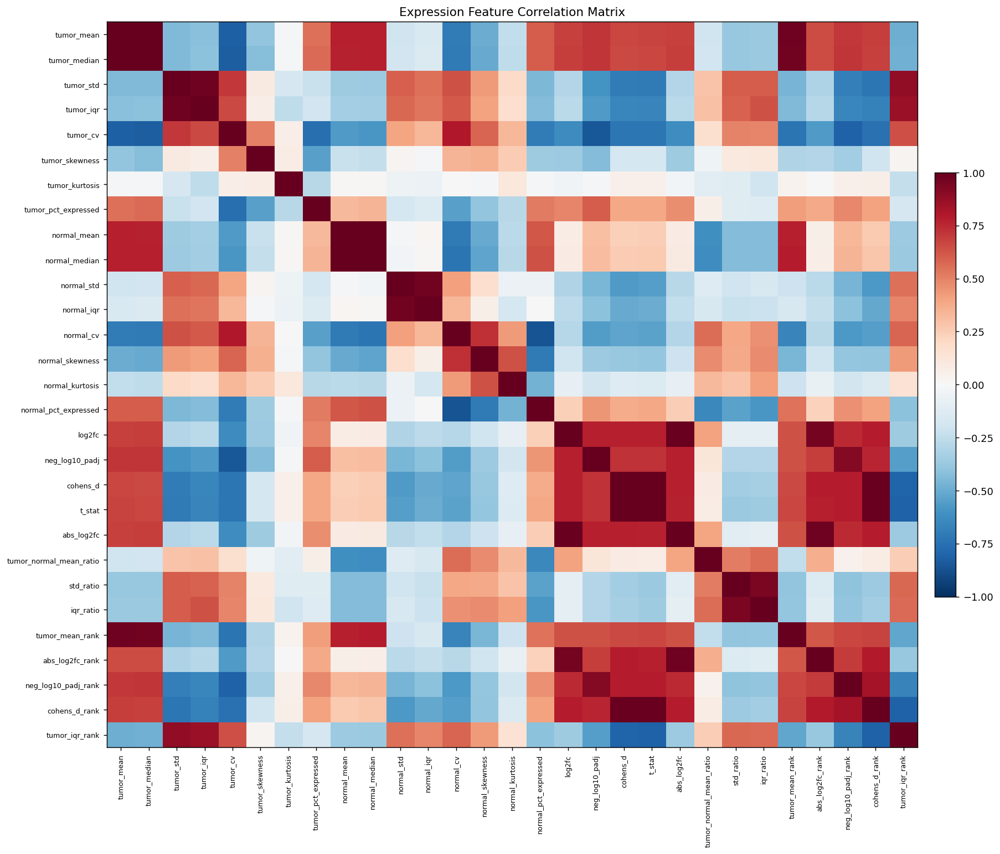 | Correlation heatmap of features.                           |
| `feature_importance_grouped.png`       | 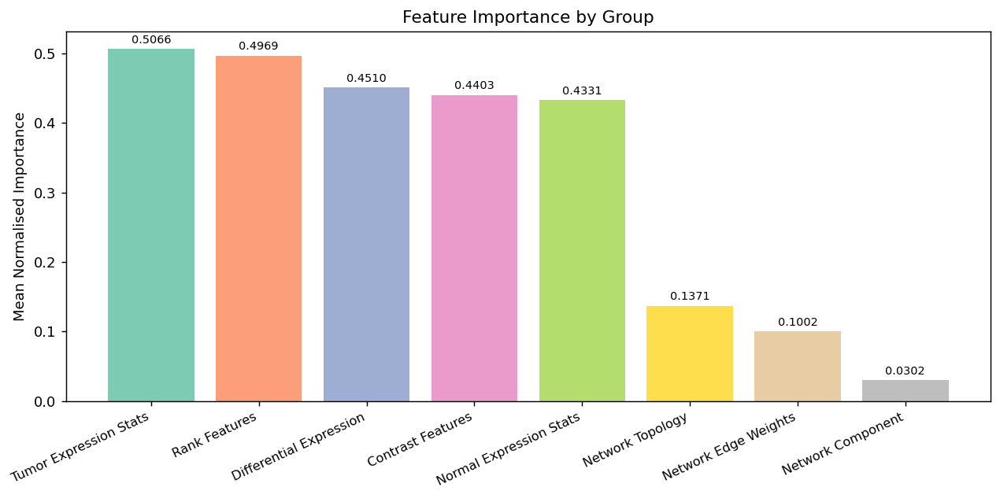             | Grouped feature importance.                                |
| `harmonization_venn.png`               | 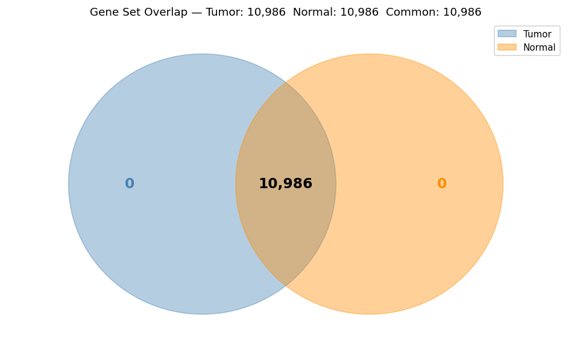                             | Venn diagram of gene overlap.                              |
| `integrated_feature_pca.png`           | 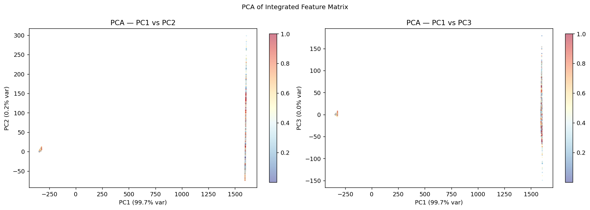                     | PCA of integrated features.                                |
| `label_class_balance.png`              | 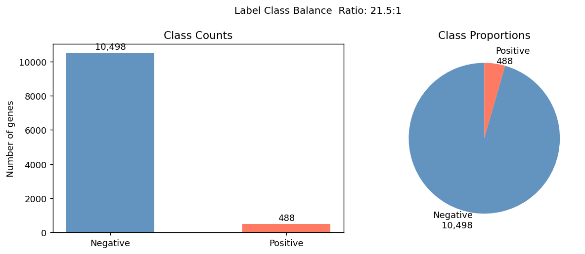                           | Class distribution bar plot.                               |
| `network_degree_distribution.png`      | 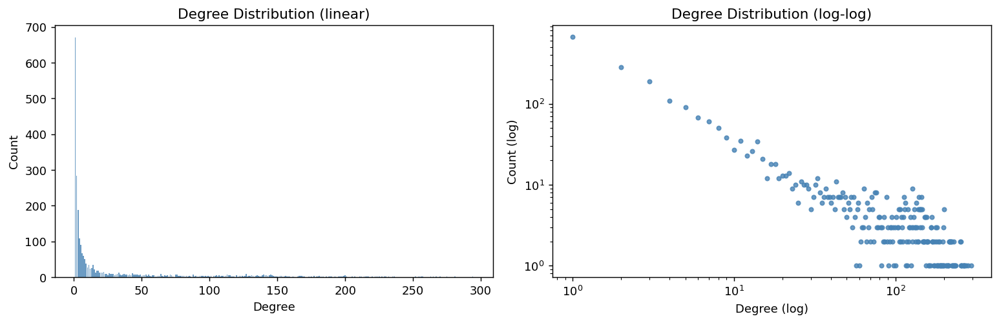           | Network node degree distribution.                          |
| `network_feature_distributions.png`    | 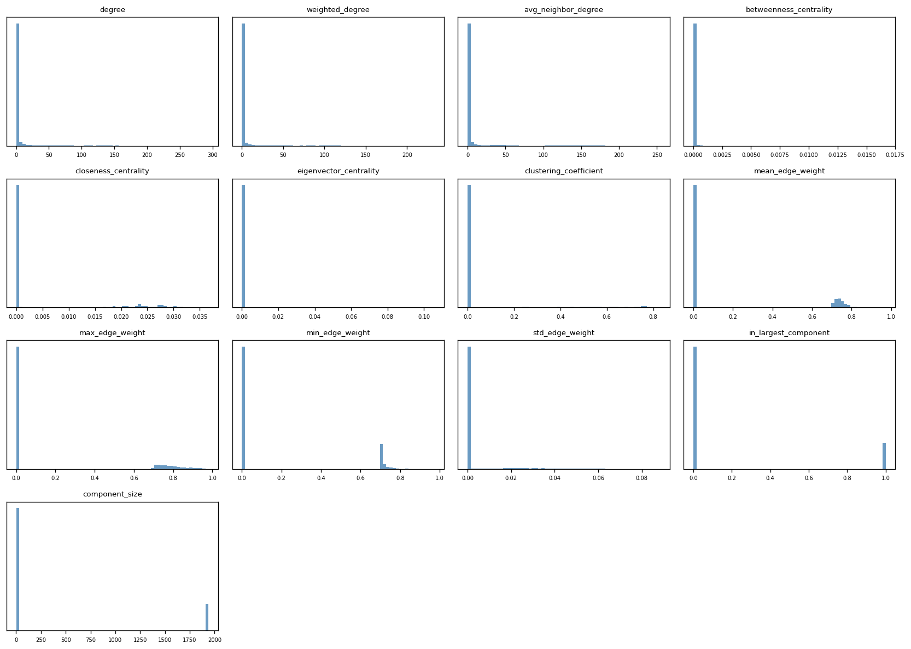       | Network feature distributions.                             |
| `qc_gene_filter_summary.png`           | 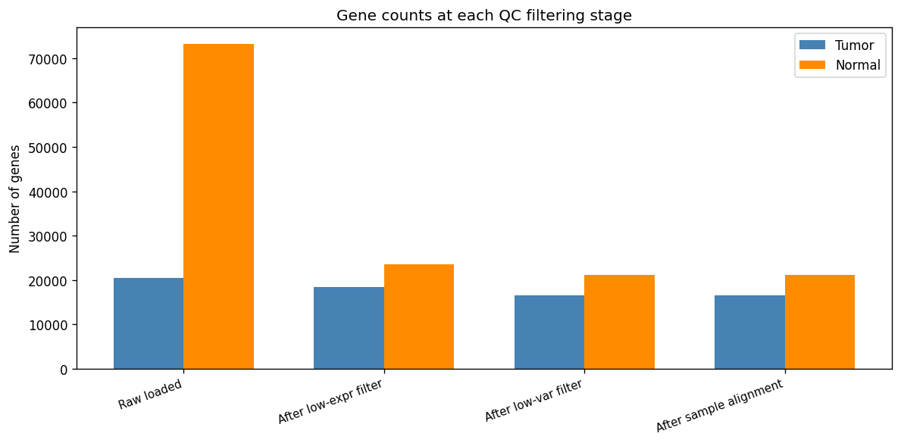                     | QC gene filtering summary.                                 |
| `qc_normal_sample_distributions.png`   | 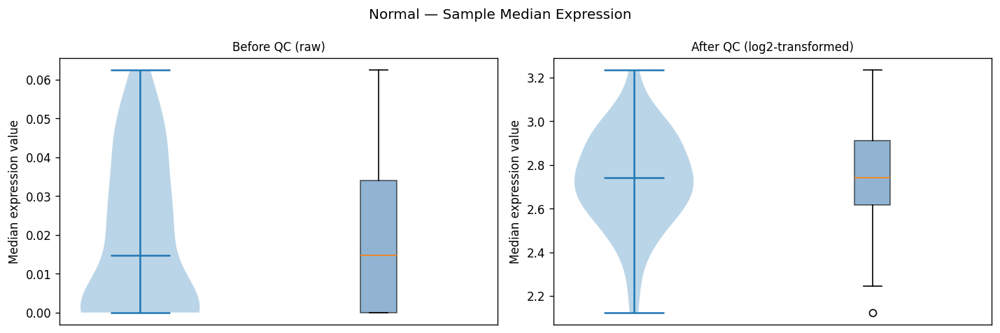     | QC normal sample distributions.                            |
| `qc_tumor_sample_distributions.png`    | 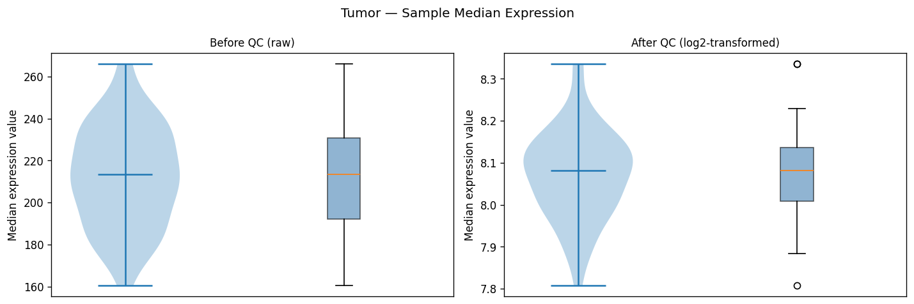       | QC tumor sample distributions.                             |
| `ranking_score_distribution.png`       | 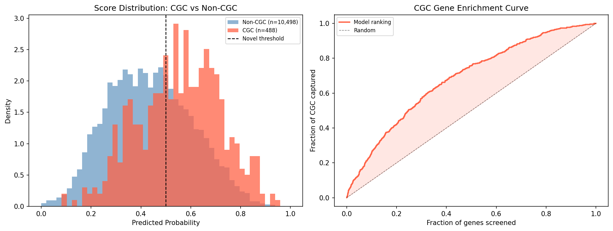             | Distribution of ranking scores.                            |
| `split_feature_pca.png`                | 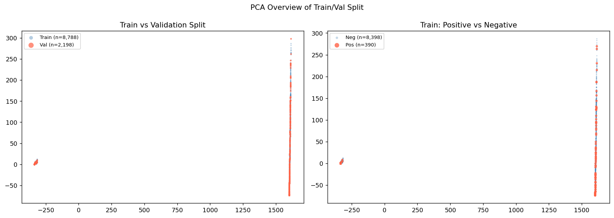                               | PCA of train/validation split.                             |

### Interactive Dashboards (HTML Files)

| Name                                    | Preview Link                                                          | Description                                       |
| --------------------------------------- | --------------------------------------------------------------------- | ------------------------------------------------- |
| `interactive_dashboard.html`          | [Open Dashboard](interactive_dashboard.html)                   | Main interactive dashboard for exploring results. |
| `interactive_feature_importance.html` | [Open Feature Importance](interactive_feature_importance.html) | Interactive feature importance visualization.     |
| `interactive_network.html`            | [Open Network](interactive_network.html)                       | Interactive gene network visualization.           |
| `interactive_ranking.html`            | [Open Ranking](interactive_ranking.html)                       | Dynamic feature ranking.                          |
| `interactive_volcano.html`            | [Open Volcano Plot](interactive_volcano.html)                  | Interactive volcano plot for DE genes.            |

## Notes

- The images in the `figures/` directory are included above for quick preview.
- The interactive HTML files can be opened in a web browser via the links.
- All visualizations support interpretation of data quality, feature importance, model performance, and biological insights.
- The structure supports reproducibility and clarity in analysis workflows.
