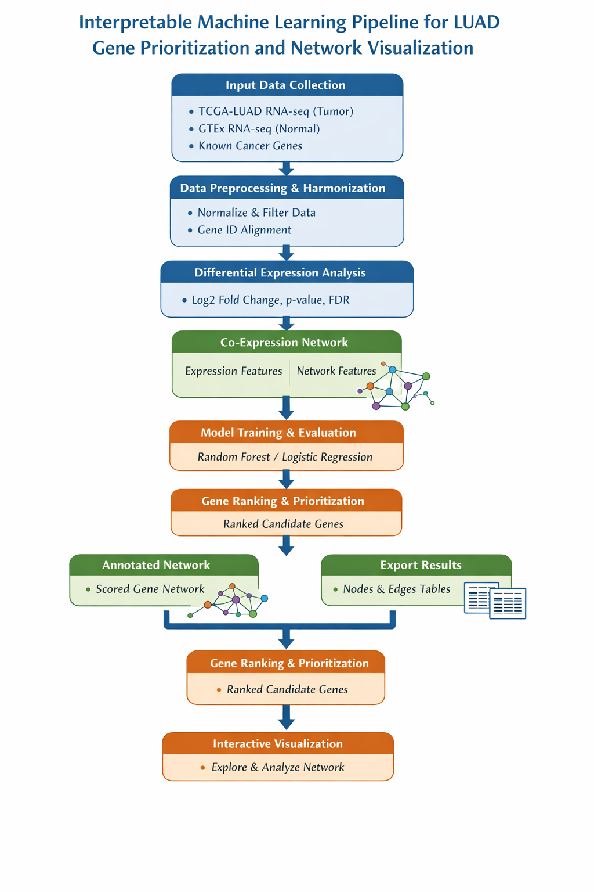

## `/workflow/` Directory

This directory contains visual and textual documentation of the machine learning project workflow, including process diagrams and lifecycle documentation.

| File Name | Description | Preview |
|-----------|-------------|---------|
| `ML_pipeline.png` | **Complete Machine Learning Pipeline Diagram** - Visual representation of the end-to-end ML workflow from data collection to deployment. |  |
| `Simplified_Workflow.png` | **Simplified Workflow Diagram** - High-level overview of the project workflow, focusing on key stages and decision points. |  |
| `project_lifecycle.txt` | **Project Lifecycle Documentation** - Detailed description of the project phases, including planning, development, deployment, and maintenance. | [View](project_lifecycle.txt) |
| `steps.txt` | **Step-by-Step Process Guide** - Sequential breakdown of tasks and procedures followed throughout the project. | [View](steps.txt) |

---

### Workflow Overview

#### **Complete ML Pipeline (`ML_pipeline.png`)**
This diagram illustrates the comprehensive machine learning workflow:
1. **Data Collection & Preparation** - Gathering and cleaning raw data
2. **Exploratory Data Analysis (EDA)** - Understanding data patterns and relationships
3. **Feature Engineering** - Creating and selecting relevant features
4. **Model Training** - Training multiple algorithms with hyperparameter tuning
5. **Model Evaluation** - Cross-validation and performance assessment
6. **Model Selection** - Choosing the best model based on evaluation metrics
7. **Deployment** - Implementing the model in production environment
8. **Monitoring & Maintenance** - Ongoing performance tracking and updates

#### **Simplified Workflow (`Simplified_Workflow.png`)**
This high-level diagram shows the core process flow:
- **Input Data** → **Preprocessing** → **Model Training** → **Evaluation** → **Deployment**
- Key decision points and validation steps
- Feedback loops for model improvement

#### **Project Lifecycle (`project_lifecycle.txt`)**
Documents the complete project timeline and phases:
- **Phase 1: Planning & Requirements** - Define objectives, scope, and success metrics
- **Phase 2: Data Preparation** - Data collection, cleaning, and validation
- **Phase 3: Model Development** - Algorithm selection, training, and optimization
- **Phase 4: Validation & Testing** - Performance evaluation and validation
- **Phase 5: Deployment** - Integration into production systems
- **Phase 6: Monitoring & Iteration** - Ongoing performance tracking and updates

#### **Step-by-Step Guide (`steps.txt`)**
Detailed procedural documentation covering:
- Environment setup and dependency installation
- Data loading and preprocessing steps
- Model training and hyperparameter tuning procedures
- Evaluation metrics calculation and interpretation
- Model saving and deployment instructions

---

### How to Use These Resources

1. **For New Team Members**: Start with `Simplified_Workflow.png` to understand the high-level process, then review `steps.txt` for implementation details.

2. **For Project Planning**: Refer to `project_lifecycle.txt` to understand project phases and timelines.

3. **For Technical Implementation**: Use `ML_pipeline.png` as a reference for the complete technical workflow and `steps.txt` for specific implementation instructions.

4. **For Presentations**: Use the PNG diagrams in reports, presentations, or documentation to visually explain the workflow.

---

### Notes
- The workflow diagrams were created to ensure reproducibility and maintainability of the ML pipeline.
- All workflow documentation should be updated when significant changes are made to the pipeline.
- The `steps.txt` file serves as both documentation and a checklist for executing the workflow.
